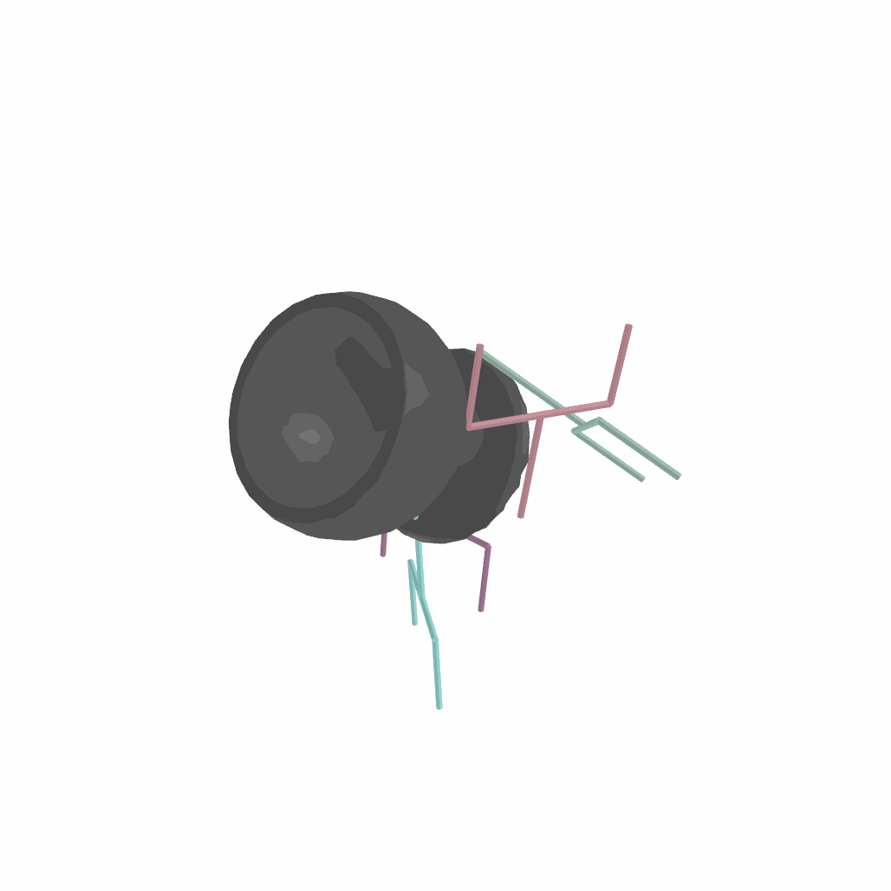
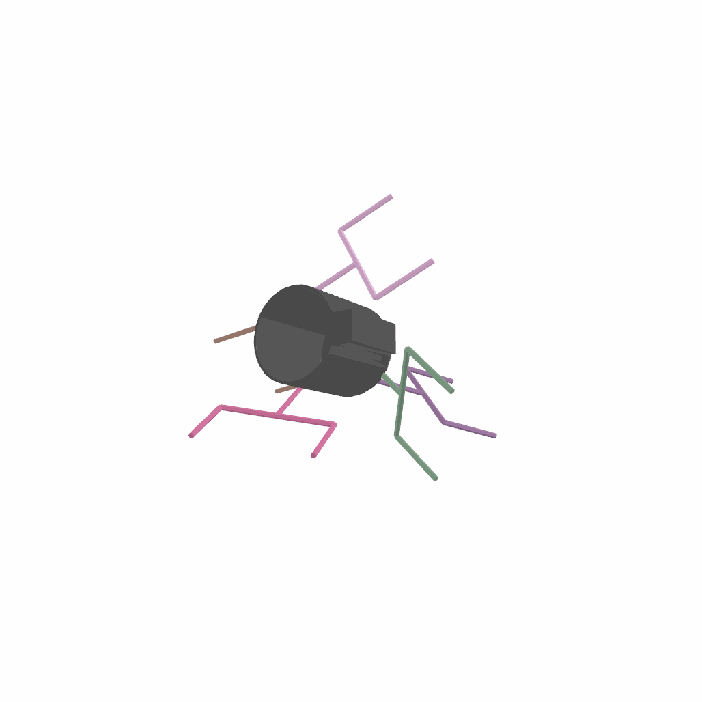
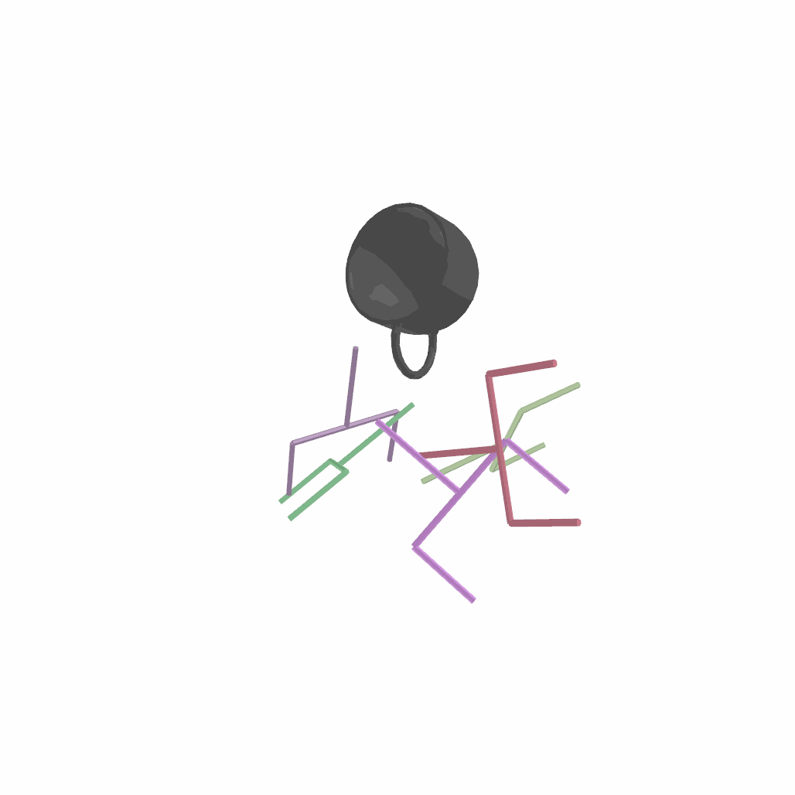
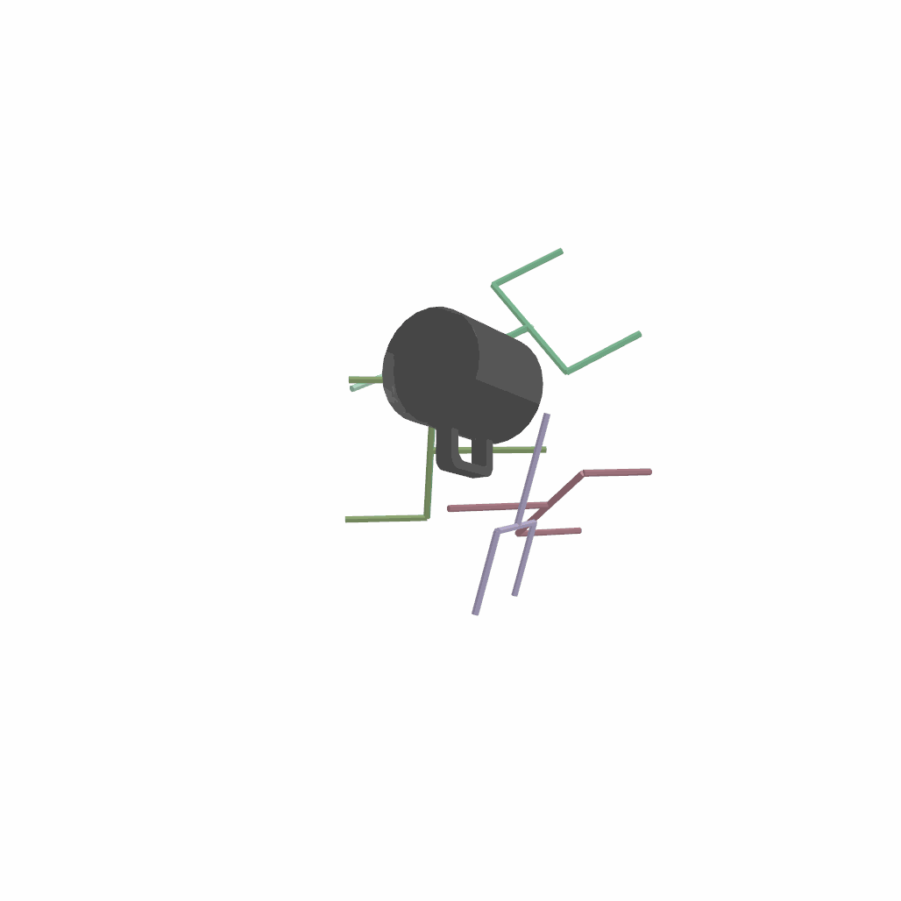

# Pytorch implementation of Diffusion models in SE(3) for grasp and motion generation

This library provides the tools for training and sampling diffusion models in SE(3),
implemented in PyTorch. 
We apply them to learn 6D grasp distributions. We use the learned distribution as cost function
for grasp and motion optimization problems.
See reference [1] for additional details.




## Installation

Create a conda environment
```python
conda env create -f environment.yml
```
Activate the environment and install the library
```python
conda activate se3dif_env && pip install -e .
```

## Preproccessed Acronym [2] and Shapenet dataset [3]

Download the preprocessed dataset and unzip the folder in the before the root directory 
1. Mugs (Grasps, Meshes, SDF, Pointcloud) [data](https://drive.google.com/file/d/1fURx7bTutANvOFvbKeo8XahT-R3A_vxH/view?usp=sharing)


## Trained Models

Download the trained models and unzip the folder in the before the root directory
1. Pointcloud conditioned SE(3) GraspDiffusion model [PointGraspDif](https://drive.google.com/file/d/1Y0ZWAhs0GSL7A-J3yA7ts3N8TnQTGHon/view?usp=sharing)


## Sample examples

Generate SE(3) grasp poses 
```azure
python scripts/sample/generate_pointcloud_6d_grasp_poses.py --n_poses 10 --n_obj 0
```


## References

[1] Julen Urain*, Niklas Funk*, Georgia Chalvatzaki, Jan Peters. 
"SE(3)-DiffusionFields: Learning cost functions for
joint grasp and motion optimization through diffusion" 
*Under review* 2022.
[[arxiv]](https://arxiv.org/)

```
@article{urain2022se3dif,
  title={Learning cost functions for joint grasp and motion optimization through diffusion},
  author={Urain, Julen and Funk, Niklas and Chalvatzaki, Georgia and Peters, Jan},
  journal={Conference on Robot Learning},
  year={2022}
```

[2] Eppner Clemens, Arsalan Mousavian, Dieter Fox. 
"Acronym: A large-scale grasp dataset based on simulation." 
*IEEE International Conference on Robotics and Automation (ICRA)*. 
2021 [[arxiv]](https://arxiv.org/abs/2011.09584)


[3] Chang Angel X., et al. 
"Shapenet: An information-rich 3d model repository." 
*arXiv preprint arXiv:1512.03012*. 2015 [[arxiv]](https://arxiv.org/abs/1512.03012)
